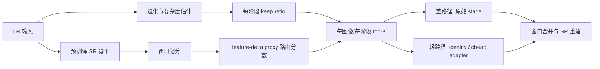

# B2R-SR 图像超分辨率与动态轻量化文献梳理

> **用途**：为 B2R-SR 后续论文的 Introduction、Related Work、实验对比和创新性表述准备参考文献。
> **检索时间**：2026-07-25
> **文献规模**：30 篇精选文献，而非追求数量的全量罗列。
> **时间范围**：近期文献主要限定在 2022–2026 年；对构成技术脉络或当前代码骨干网络来源的经典工作保留时间例外。

---

## 1. 本次收集计划与筛选方法

### 1.1 研究问题

本次检索围绕三个问题展开：

1. 单图像超分辨率（SISR）从早期 CNN 到残差、注意力和轻量化网络的发展脉络是什么？
2. 近 3–4 年中，哪些工作真正研究了轻量化、压缩、设备感知或高效 SR，而不仅仅是提高 PSNR？
3. 哪些工作与 B2R-SR 的窗口路由、按阶段动态计算、top-K 选择、预算分配和退化感知最接近，因而必须在论文中讨论？

### 1.2 检索主题

使用的主题组合包括：

```text
single image super-resolution + lightweight / efficient / mobile
super-resolution + dynamic routing / adaptive inference / early exit
super-resolution + patch routing / window routing / top-K refinement
super-resolution + pruning / quantization / neural architecture search
super-resolution + degradation-aware routing / conditional computation
```

优先核查 CVF、ECVA、AAAI、NeurIPS、PMLR、ACM、Springer、IEEE、arXiv 和作者项目页中的官方标题、作者、年份、摘要与 DOI。

### 1.3 纳入标准

文献至少满足一项：

- 是 SISR 的经典方法或当前实现骨干网络的直接来源；
- 在 SISR 中动态改变图像、patch、window、pixel、stage 或 expert 的计算量；
- 明确研究轻量化、剪枝、量化、设备延迟或质量—计算量权衡；
- 与 B2R-SR 的 feature-delta 路由、top-K、预算控制或退化条件直接相关；
- 属于近 3–4 年的重要同行评议论文，并能为实验基线或讨论提供价值。

### 1.4 排除标准

- 仅使用 attention 重新加权、但不减少或重定向计算的普通注意力模块；
- 与 SR 没有清晰实验关联的通用图像恢复网络；
- 只报告参数量或 FLOPs、且缺少质量—效率讨论的重复轻量网络；
- 只有预印本、元数据或发表状态无法可靠核验的工作；
- 与当前失真导向 CNN-SR 路线差异过大的感知/GAN/扩散工作，除非其动态计算机制具有直接参考意义。

---

## 2. 与当前 B2R-SR 实现的对应关系

当前代码实现应描述为：**面向预训练 CNN-SR 骨干的动态推理加速包装器**。它目前支持 RCAN、CARN-M 和 MSRResNet/SRResNet 路径，而不是已经验证的通用 Transformer 插件。



### 2.1 论文表述必须保持准确

当前实现中的 “benefit” 监督是密集 stage 的特征变化：

```text
mean(|stage_out - x|)
```

它是 **dense-stage feature-delta proxy**，不是直接利用 GT 计算的“跳过与保留之间的 PSNR/重建损失增益”。同时，top-K 是**按图像、按阶段**执行，并由学习到的 keep ratio 决定，不宜写成跨图像或跨阶段的“全局精确 top-K”。

相对安全的创新定位是：

> B2R-SR 将 warm-up 阶段的 dense-stage feature-delta proxy、按图像/按阶段的窗口 top-K 路由，以及由退化与复杂度条件控制的阶段 keep ratio 组合到预训练 CNN-SR 骨干中。

不应声称：

- 首次在 SR 中选择 top-K patch（MGA 已明确选择 K 个特征 patch）；
- 首次在 SR 中进行内容感知窗口/区域路由（ClassSR、FADN、CAMixerSR 已覆盖）；
- 首次进行退化感知动态计算（MoR 已按退化严重度改变激活专家数）；
- 已经证明支持任意 CNN/Transformer 骨干。

---

## 3. 建议阅读优先级

### Tier A：必须精读并在 Related Work 中正面比较

RCAN、CARN、SRResNet/SRGAN、AdaDSR、ClassSR、FADN、APE、ARM、MGA、CABM、TADT、CAMixerSR、PCSR、ENAF、MoR。

### Tier B：重要背景或实验基线

SRCNN、FSRCNN、ESPCN、EDSR、IMDN、CDNSR、Compiler-Aware NAS-SR、RLFN、ISS-P、FMP、QuantSR。

### Tier C：前沿架构与扩展方向

NGswin、SAFMN、HiT-SR、PatchScaler。它们适合讨论未来 Transformer/扩散扩展，但不能用于证明当前 CNN 插件已经具备这些能力。

---

## 4. 精选文献地图（30 篇）

相关度：**高** = 直接创新对手；**中** = 重要轻量化或机制参考；**基础** = 经典技术脉络/骨干来源。

### 4.1 经典 SISR 与骨干网络（8 篇）

| # | 论文 | 年份/会议 | 核心贡献 | 与 B2R-SR 的关系 | 相关度 |
|---:|---|---|---|---|---|
| 1 | [SRCNN: Learning a Deep Convolutional Network for Image Super-Resolution](https://doi.org/10.1007/978-3-319-10593-2_13) | ECCV 2014 | 首个代表性的端到端 CNN-SR，将特征提取、映射和重建联合学习 | 建立深度 SISR 起点；其 HR 空间计算也说明高效 LR 空间设计的必要性 | 基础 |
| 2 | [FSRCNN: Accelerating the Super-Resolution Convolutional Neural Network](https://arxiv.org/abs/1608.00367) | ECCV 2016 | 在 LR 空间提取特征，并使用收缩—映射—扩张与反卷积上采样 | 经典静态轻量骨干和延迟上采样先例 | 基础 |
| 3 | [ESPCN: Real-Time Single Image and Video Super-Resolution Using an Efficient Sub-Pixel CNN](https://doi.org/10.1109/CVPR.2016.207) | CVPR 2016 | 提出 sub-pixel convolution/pixel shuffle，使大部分卷积位于 LR 空间 | 当前多数 SR 网络高效上采样设计的基础 | 基础 |
| 4 | [Photo-Realistic SISR Using a GAN（SRResNet/SRGAN）](https://openaccess.thecvf.com/content_cvpr_2017/html/Ledig_Photo-Realistic_Single_Image_CVPR_2017_paper.html) | CVPR 2017 | 提出 SRResNet 与感知/GAN 训练路线 | 当前 MSRResNet/SRResNet 实现路径的来源；论文实验需引用 | 基础 |
| 5 | [EDSR: Enhanced Deep Residual Networks for Single Image Super-Resolution](https://doi.org/10.1109/CVPRW.2017.151) | CVPRW 2017 | 去除 BN、扩大残差网络容量、引入 residual scaling | 重型残差 SR 的标准基线；重复残差块适合阶段路由 | 基础 |
| 6 | [Cascading Residual Network（CARN）](https://doi.org/10.1007/978-3-030-01249-6_16) | ECCV 2018 | 局部/全局级联特征复用，并提出移动版 CARN-M | 当前插件直接支持的轻量骨干；可比较静态轻量与动态路由 | 高 |
| 7 | [RCAN: Image Super-Resolution Using Very Deep Residual Channel Attention Networks](https://doi.org/10.1007/978-3-030-01234-2_18) | ECCV 2018 | residual-in-residual 与 channel attention，构建很深的高质量 SR 网络 | 当前主要训练骨干，也是动态跳过重计算的直接对象 | 高 |
| 8 | [IMDN: Lightweight Image Super-Resolution with Information Multi-distillation Network](https://doi.org/10.1145/3343031.3351084) | ACM MM 2019 | 多阶段信息蒸馏与 contrast-aware channel attention | 代表静态轻量路线；适合作为“固定低成本 vs 输入自适应成本”的对照 | 中 |

> 注：CARN 在文中应始终写为 **Cascading Residual Network**，避免与其他同名缩写方法混淆。

### 4.2 动态、内容感知与预算化 SR（14 篇）

| # | 论文 | 年份/会议 | 动态粒度与信号 | 与 B2R-SR 的关键异同 | 相关度 |
|---:|---|---|---|---|---|
| 9 | [AdaDSR: Deep Adaptive Inference Networks for Single Image Super-Resolution](https://arxiv.org/abs/2004.03915) | ECCV Workshops 2020 | 内容/资源自适应推理 | 较早的自适应 SR 先例；注意其为 workshop 论文 | 高 |
| 10 | [ClassSR: A General Framework to Accelerate SR Networks by Data Characteristic](https://openaccess.thecvf.com/content/CVPR2021/html/Kong_ClassSR_A_General_Framework_to_Accelerate_Super-Resolution_Networks_by_Data_CVPR_2021_paper.html) | CVPR 2021 | patch 难度分类并路由至不同容量子网 | 本仓库保留的直接基线；B2R-SR 改为共享骨干内的 stage/window 路由 | 高 |
| 11 | [FADN: Learning Frequency-Aware Dynamic Network for Efficient Super-Resolution](https://openaccess.thecvf.com/content/ICCV2021/html/Xie_Learning_Frequency-Aware_Dynamic_Network_for_Efficient_Super-Resolution_ICCV_2021_paper.html) | ICCV 2021 | DCT 高频区域走重操作、低频区域走轻操作 | 与当前 variance/feature-delta 空间路由高度相关；FADN 更依赖频率先验 | 高 |
| 12 | [APE: Adaptive Patch Exiting for Scalable SISR](https://www.ecva.net/papers/eccv_2022/papers_ECCV/html/2021_ECCV_2022_paper.php) | ECCV 2022 | 回归 patch 的逐层 incremental capacity，并按阈值早退 | 最接近“阶段增量价值”的先例；但不是按阶段 top-K，也无退化条件预算 | 高 |
| 13 | [ARM: Any-Time Super-Resolution Method](https://www.ecva.net/papers/eccv_2022/papers_ECCV/html/4931_ECCV_2022_paper.php) | ECCV 2022 | 共享权重子网 + Edge-to-PSNR/成本查找分配 patch | 强质量—成本分配先例；B2R-SR 使用学习到的阶段 keep ratio | 高 |
| 14 | [MGA: Restore Globally, Refine Locally](https://www.ecva.net/papers/eccv_2022/papers_ECCV/html/4417_ECCV_2022_paper.php) | ECCV 2022 | mask 预测 under-restored 区域并选 K 个特征 patch 精修 | **最重要 top-K 先例**；B2R-SR 必须强调多阶段 feature-delta 与条件 keep ratio，而不能声称首创 K-patch | 高 |
| 15 | [CABM: Content-Aware Bit Mapping for SISR Network With Large Input](https://openaccess.thecvf.com/content/CVPR2023/html/Tian_CABM_Content-Aware_Bit_Mapping_for_Single_Image_Super-Resolution_Network_With_CVPR_2023_paper.html) | CVPR 2023 | 按 patch/层选择量化 bit | 同样进行内容感知资源分配，但控制的是数值精度而非阶段执行 | 高 |
| 16 | [CDNSR: Classification-Based Dynamic Network for Efficient Super-Resolution](https://doi.org/10.1109/ICASSP49357.2023.10096521) | ICASSP 2023 | 分类驱动的动态 SR 推理 | ClassSR 路线的近期补充基线，适合比较分类式与排序式路由 | 中 |
| 17 | [TADT: Task-Aware Dynamic Transformer for Efficient Arbitrary-Scale SR](https://doi.org/10.3233/FAIA240484) | ECAI 2024 | 输入与 scale 条件控制 branch，STE 离散选择 | scale/task-conditioned compute 与退化条件 keep ratio 概念接近；但属于 Transformer 分支路由 | 高 |
| 18 | [CAMixerSR: Only Details Need More “Attention”](https://openaccess.thecvf.com/content/CVPR2024/html/Wang_CAMixerSR_Only_Details_Need_More_Attention_CVPR_2024_paper.html) | CVPR 2024 | 预测 window mask；简单区域用卷积，复杂区域附加窗口注意力 | **最直接的窗口级内容路由对手**；B2R-SR 的区别应落在 feature-delta proxy 与条件化预算 | 高 |
| 19 | [PCSR: Accelerating Image SR Networks with Pixel-Level Classification](https://www.ecva.net/papers/eccv_2024/papers_ECCV/papers/00370.pdf) | ECCV 2024 | pixel 级分支选择，并纳入分支成本 | 粒度比 B2R-SR 更细；其边界伪影讨论可支撑 TV/mask 平滑消融 | 高 |
| 20 | [ENAF: A Multi-Exit Network with Adaptive Patch Fusion for Large Image SR](https://openaccess.thecvf.com/content/WACV2025/html/Nguyen_ENAF_A_Multi-Exit_Network_with_an_Adaptive_Patch_Fusion_for_WACV_2025_paper.html) | WACV 2025 | 学习 patch hardness、多出口与自适应 patch 融合 | 近期 patch early-exit 必比方法；B2R-SR 使用 stage/window top-K 而非独立出口阈值 | 高 |
| 21 | [PatchScaler: An Efficient Patch-Independent Diffusion Model for Image SR](https://openaccess.thecvf.com/content/ICCV2025/html/Liu_PatchScaler_An_Efficient_Patch-Independent_Diffusion_Model_for_Image_Super-Resolution_ICCV_2025_paper.html) | ICCV 2025 | 按 patch 重建难度分组并分配不同扩散采样路径 | 架构不同，但证明 patch 难度应驱动不等计算预算；仅作前沿机制对照 | 中 |
| 22 | [MoR: Mixture of Ranks with Degradation-Aware Routing for One-Step Real-World ISR](https://doi.org/10.1609/aaai.v40i6.42469) | AAAI 2026 | CLIP 退化分数控制 LoRA rank 专家激活数 | **最接近退化感知预算的先例**；B2R-SR 的区别是 CNN stage/window 与 feature-delta 排序 | 高 |

### 4.3 近年静态轻量、压缩和硬件感知 SR（8 篇）

| # | 论文 | 年份/会议 | 核心贡献 | 对 B2R-SR 的价值 | 相关度 |
|---:|---|---|---|---|---|
| 23 | [Compiler-Aware Neural Architecture Search for On-Mobile Real-time SR](https://www.ecva.net/papers/eccv_2022/papers_ECCV/papers/136790089.pdf) | ECCV 2022 | 用编译器/真实设备反馈搜索深度与宽度，而非只优化 FLOPs | 支撑 B2R-SR 使用设备延迟 LUT 或真实 latency budget，避免 FLOPs=速度的错误 | 高 |
| 24 | [RLFN: Residual Local Feature Network for Efficient Super-Resolution](https://openaccess.thecvf.com/content/CVPR2022W/NTIRE/html/Kong_Residual_Local_Feature_Network_for_Efficient_Super-Resolution_CVPRW_2022_paper.html) | CVPRW/NTIRE 2022 | 简化局部特征聚合，并在 NTIRE runtime track 中表现突出 | 适合静态高效 CNN 与真实 runtime 基线；注意为 workshop/challenge 工作 | 中 |
| 25 | [NGswin: N-Gram in Swin Transformers for Efficient Lightweight ISR](https://openaccess.thecvf.com/content/CVPR2023/html/Choi_N-Gram_in_Swin_Transformers_for_Efficient_Lightweight_Image_Super-Resolution_CVPR_2023_paper.html) | CVPR 2023 | N-gram 滑动窗口扩大有效上下文，保持轻量 | 提供高效窗口上下文设计；属于未来 Transformer 扩展而非当前能力 | 中 |
| 26 | [SAFMN: Spatially-Adaptive Feature Modulation for Efficient ISR](https://openaccess.thecvf.com/content/ICCV2023/html/Sun_Spatially-Adaptive_Feature_Modulation_for_Efficient_Image_Super-Resolution_ICCV_2023_paper.html) | ICCV 2023 | 多尺度空间调制，以部署友好的 dense 操作获取广域上下文 | 可作为轻量 router/estimator 或未来骨干模块；本身不跳过计算 | 中 |
| 27 | [ISS-P: Iterative Soft Shrinkage Learning for Efficient ISR](https://openaccess.thecvf.com/content/ICCV2023/html/Wang_Iterative_Soft_Shrinkage_Learning_for_Efficient_Image_Super-Resolution_ICCV_2023_paper.html) | ICCV 2023 | 从头训练稀疏结构的迭代软收缩剪枝 | 最重要静态剪枝对照，可区分“普通压缩收益”与“条件计算收益” | 高 |
| 28 | [HiT-SR: Hierarchical Transformer for Efficient Image SR](https://doi.org/10.1007/978-3-031-73661-2_27) | ECCV 2024 Oral | 层次窗口与线性空间—通道相关，扩大感受野并控制复杂度 | 高效 Transformer 前沿背景；不代表当前插件已支持 Transformer | 中 |
| 29 | [FMP: Lightweight Image SR via Flexible Meta Pruning](https://proceedings.mlr.press/v235/zhang24cc.html) | ICML 2024 | 超网络联合控制结构化通道剪枝与非结构化权重剪枝 | 可作为 pruning baseline 或先压缩后动态路由的组合方向 | 高 |
| 30 | [QuantSR: Accurate Low-bit Quantization for Efficient Image SR](https://proceedings.neurips.cc/paper_files/paper/2023/hash/b2169d573d75ff90c7b12dc3a5fc2898-Abstract-Conference.html) | NeurIPS 2023 Spotlight | RLQ 改善低 bit 表征，DQA 支持深度动态的量化推理 | 重要部署/量化基线，也提醒路由决策需要验证量化稳定性 | 高 |

---

## 5. 主题综合与研究空缺

### 5.1 静态轻量化与动态轻量化是两条不同路线

CARN、IMDN、RLFN、ISS-P、FMP 和 QuantSR 通过结构设计、蒸馏、剪枝或量化降低所有输入的固定成本。ClassSR、APE、MGA、CAMixerSR、PCSR 和 B2R-SR 则依据内容差异分配不等计算。论文实验应同时放入至少一个静态轻量基线和一个动态路由基线，否则无法说明收益来自动态分配而不是普通模型压缩。

### 5.2 路由信号从启发式难度走向学习到的增量价值

已有信号包括边缘/频率（AdaDSR、FADN、ARM）、分类难度（ClassSR、CDNSR、ENAF）、under-restored mask（MGA）、incremental capacity（APE）、内容窗口预测（CAMixerSR）和退化严重度（MoR）。B2R-SR 当前的 feature-delta proxy 位于启发式难度和真实重建增益之间：比单纯边缘更贴近 stage 表征变化，但仍不等于 GT 驱动的 PSNR/L1 增益。后续可考虑直接监督：

```text
benefit = loss(skip, GT) - loss(dense, GT)
```

并与当前 feature-delta proxy 做消融。

### 5.3 top-K 本身不是创新点，组合方式才可能是

MGA 已明确选 K 个 under-restored 特征 patch。因此 B2R-SR 的表述重点应是：

- top-K 在多个 backbone stage 内执行；
- 路由排序由 dense-stage feature-delta proxy 学习；
- 每个 stage 的 keep ratio 由退化、复杂度和用户预算共同决定；
- 未保留窗口可走 cheap adapter，而不仅是简单丢弃。

### 5.4 FLOPs 不等于真实加速

APE、Compiler-Aware NAS-SR、RLFN、CABM 等工作共同提示：不规则稀疏、gather/scatter、分支调度和硬件 kernel 支持会造成理论 FLOPs 与 wall-clock latency 不一致。B2R-SR 必须至少报告：

```text
PSNR / SSIM
参数量
理论或实测 FLOPs
keep ratio
router + degradation estimator 开销
端到端 latency / throughput
峰值显存
目标硬件与输入分辨率
```

当前代码中 `base_flops: 0.0` 仍不足以支持绝对 FLOPs 声明；`sync_latency` 关闭时的 CUDA 时间也不能直接作为严格 latency 结果。

### 5.5 退化感知需要比纹理复杂度更严格的证据

当前退化代理来自 batch 内归一化的逆 Laplacian 高频能量，可能把低纹理内容误认为强退化。MoR 使用 CLIP 退化语义进行动态专家激活，是更接近的前沿对照。论文应分别验证 blur、noise、JPEG 等退化下的预算变化，避免只在 bicubic DIV2K 上把“内容复杂度”解释成“退化程度”。

---

## 6. 建议的实验对比矩阵

### 6.1 最小必要基线

| 类型 | 建议方法 |
|---|---|
| 原始重型骨干 | RCAN / SRResNet |
| 静态轻量骨干 | CARN-M、IMDN 或 RLFN |
| patch 分类路由 | ClassSR |
| early exit / anytime | APE、ARM 或 ENAF |
| top-K 局部精修 | MGA |
| 窗口内容路由 | CAMixerSR |
| B2R-SR 消融 | threshold 路由、无 benefit、无 allocator、无 cheap adapter、固定预算 |

### 6.2 必须展示的曲线

- PSNR–FLOPs Pareto；
- PSNR–真实 latency Pareto；
- 用户预算–实际 keep ratio；
- 不同退化强度–预测预算；
- router/allocator/cheap adapter 的额外延迟；
- route window 大小与边界伪影/TV loss 的关系；
- soft warm-up 与 hard routing 前后的性能变化。

### 6.3 推荐数据集层级

- 标准失真导向：Set5、Set14、BSD100、Urban100、Manga109、DIV2K validation；
- 大图动态路由：DIV8K 或 Test2K/Test4K/Test8K；
- 若声称退化感知：加入合成 blur/noise/JPEG 组合或真实世界 SR 数据，而不能只使用 bicubic。

---

## 7. Related Work 建议写作结构

### 7.1 Single Image Super-Resolution

用 SRCNN、FSRCNN/ESPCN、EDSR/SRResNet、RCAN 简要建立从 CNN、LR 空间计算到深残差/注意力骨干的脉络，不宜写成大篇幅模型年表。

### 7.2 Lightweight and Efficient SR

将 CARN/IMDN/RLFN 与 ISS-P/FMP/QuantSR 分为静态架构、剪枝和量化三类；强调这些方法对所有输入使用固定计算图。

### 7.3 Dynamic and Content-Adaptive SR

以 AdaDSR、ClassSR、FADN 为早期路线，接 APE/ARM/MGA/CABM，再讨论 CAMixerSR、PCSR、ENAF 和 MoR。这里是 B2R-SR 最关键的 Related Work 段落。

### 7.4 推荐的定位句

> Existing adaptive SR methods route patches by difficulty or early-exit thresholds, refine a selected set of under-restored regions, or assign content-dependent operators and precision. In contrast, B2R-SR combines a warm-up dense-stage feature-delta proxy with per-image, per-stage window top-K routing and degradation/complexity-conditioned keep ratios for pretrained CNN-based SR backbones.

这句话仍应在最终论文中根据实验结果弱化或加强，不能在没有真实 latency、FLOPs 和退化消融时直接声称显著加速或通用性。

---

## 8. 完整参考文献（按本文编号）

1. C. Dong, C. C. Loy, K. He, and X. Tang, “Learning a Deep Convolutional Network for Image Super-Resolution,” ECCV, 2014. DOI: 10.1007/978-3-319-10593-2_13.
2. C. Dong, C. C. Loy, and X. Tang, “Accelerating the Super-Resolution Convolutional Neural Network,” ECCV, 2016. arXiv:1608.00367.
3. W. Shi et al., “Real-Time Single Image and Video Super-Resolution Using an Efficient Sub-Pixel Convolutional Neural Network,” CVPR, 2016. DOI: 10.1109/CVPR.2016.207.
4. C. Ledig et al., “Photo-Realistic Single Image Super-Resolution Using a Generative Adversarial Network,” CVPR, 2017. DOI: 10.1109/CVPR.2017.19.
5. B. Lim, S. Son, H. Kim, S. Nah, and K. M. Lee, “Enhanced Deep Residual Networks for Single Image Super-Resolution,” CVPR Workshops, 2017. DOI: 10.1109/CVPRW.2017.151.
6. N. Ahn, B. Kang, and K.-A. Sohn, “Fast, Accurate, and Lightweight Super-Resolution with Cascading Residual Network,” ECCV, 2018. DOI: 10.1007/978-3-030-01249-6_16.
7. Y. Zhang, K. Li, K. Li, L. Wang, B. Zhong, and Y. Fu, “Image Super-Resolution Using Very Deep Residual Channel Attention Networks,” ECCV, 2018. DOI: 10.1007/978-3-030-01234-2_18.
8. Z. Hui, X. Gao, Y. Yang, and X. Wang, “Lightweight Image Super-Resolution with Information Multi-Distillation Network,” ACM MM, 2019. DOI: 10.1145/3343031.3351084.
9. M. Liu, Z. Zhang, L. Hou, W. Zuo, and L. Zhang, “Deep Adaptive Inference Networks for Single Image Super-Resolution,” ECCV Workshops, 2020. arXiv:2004.03915.
10. X. Kong, H. Zhao, Y. Qiao, and C. Dong, “ClassSR: A General Framework to Accelerate Super-Resolution Networks by Data Characteristic,” CVPR, 2021, pp. 12016–12025.
11. W. Xie, D. Song, C. Xu, C. Xu, H. Zhang, and Y. Wang, “Learning Frequency-Aware Dynamic Network for Efficient Super-Resolution,” ICCV, 2021, pp. 4308–4317.
12. S. Wang, J. Liu, K. Chen, X. Li, M. Lu, and Y. Guo, “Adaptive Patch Exiting for Scalable Single Image Super-Resolution,” ECCV, 2022. DOI: 10.1007/978-3-031-19797-0_17.
13. B. Chen et al., “ARM: Any-Time Super-Resolution Method,” ECCV, 2022. DOI: 10.1007/978-3-031-19800-7_15.
14. X. Hu, J. Xu, S. Gu, M.-M. Cheng, and L. Liu, “Restore Globally, Refine Locally: A Mask-Guided Scheme to Accelerate Super-Resolution Networks,” ECCV, 2022. DOI: 10.1007/978-3-031-19800-7_5.
15. S. Tian, M. Lu, J. Liu, Y. Guo, Y. Chen, and S. Zhang, “CABM: Content-Aware Bit Mapping for Single Image Super-Resolution Network With Large Input,” CVPR, 2023. DOI: 10.1109/CVPR52729.2023.00175.
16. Q. Wang, W. Fang, M. Wang, and Y. Cheng, “Classification-Based Dynamic Network for Efficient Super-Resolution,” ICASSP, 2023. DOI: 10.1109/ICASSP49357.2023.10096521.
17. T. Xu et al., “Task-Aware Dynamic Transformer for Efficient Arbitrary-Scale Image Super-Resolution,” ECAI, 2024. DOI: 10.3233/FAIA240484.
18. Y. Wang, Y. Liu, S. Zhao, J. Li, and L. Zhang, “CAMixerSR: Only Details Need More ‘Attention’,” CVPR, 2024, pp. 25837–25846.
19. J. Jeong, J. Kim, Y. Jo, and S. J. Kim, “Accelerating Image Super-Resolution Networks with Pixel-Level Classification,” ECCV, 2024.
20. M. D. Nguyen, T. N. Nguyen, and X. T. Nguyen, “ENAF: A Multi-Exit Network with an Adaptive Patch Fusion for Large Image Super Resolution,” WACV, 2025. DOI: 10.1109/WACV61041.2025.00268.
21. Y. Liu et al., “PatchScaler: An Efficient Patch-Independent Diffusion Model for Image Super-Resolution,” ICCV, 2025, pp. 11283–11293.
22. X. He et al., “Mixture of Ranks with Degradation-Aware Routing for One-Step Real-World Image Super-Resolution,” AAAI, 2026. DOI: 10.1609/aaai.v40i6.42469.
23. Y. Wu et al., “Compiler-Aware Neural Architecture Search for On-Mobile Real-Time Super-Resolution,” ECCV, 2022.
24. F. Kong et al., “Residual Local Feature Network for Efficient Super-Resolution,” CVPR Workshops/NTIRE, 2022, pp. 766–776.
25. H. Choi, J. Lee, and J. Yang, “N-Gram in Swin Transformers for Efficient Lightweight Image Super-Resolution,” CVPR, 2023, pp. 2071–2081.
26. L. Sun, J. Dong, J. Tang, and J. Pan, “Spatially-Adaptive Feature Modulation for Efficient Image Super-Resolution,” ICCV, 2023, pp. 13190–13199.
27. J. Wang, H. Wang, Y. Zhang, Y. Fu, and Z. Tao, “Iterative Soft Shrinkage Learning for Efficient Image Super-Resolution,” ICCV, 2023, pp. 12590–12599.
28. X. Zhang, Y. Zhang, and F. Yu, “HiT-SR: Hierarchical Transformer for Efficient Image Super-Resolution,” ECCV, 2024. DOI: 10.1007/978-3-031-73661-2_27.
29. Y. Zhang, K. Zhang, L. Van Gool, M. Danelljan, and F. Yu, “Lightweight Image Super-Resolution via Flexible Meta Pruning,” ICML, 2024, PMLR 235:60305–60314.
30. H. Qin, Y. Zhang, Y. Ding, Y. Liu, X. Liu, M. Danelljan, and F. Yu, “QuantSR: Accurate Low-Bit Quantization for Efficient Image Super-Resolution,” NeurIPS, 2023.

---

## 9. 本次梳理的局限与后续更新

- 这是与 B2R-SR 强相关的 targeted scoping review，不是覆盖全部 SR 论文的系统综述；
- 文献中的 FLOPs、参数量和 latency 来自不同硬件与输入设置，不能直接横向排序；
- 2025–2026 工作仍较新，代码、引用关系和最终期刊版本可能变化；
- 未找到可可靠核验、题名恰为 “DART-SR” 的外部正式论文，当前仓库中的 DART-SR 应视为项目内方法/消融命名；
- 在最终投稿前，应重新检索当年 CVPR/ICCV/ECCV/NeurIPS/AAAI，并逐条导出 BibTeX、复核 DOI 和页码；
- 下一阶段建议围绕 Tier A 文献制作精读卡片，记录任务设定、路由粒度、监督信号、预算机制、FLOPs、真实 latency、数据集和可复现实验设置。
