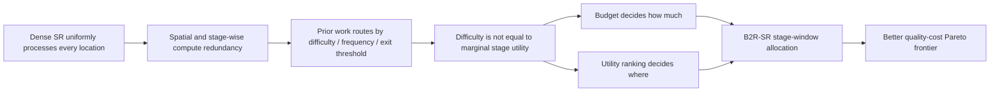

# B2R-SR 论文故事线与实验策略

> **目标**：以 CCF-C 为可靠落点，以 CCF-B 为冲击目标。
> **核心原则**：先用实验验证故事成立，再围绕成立的结论写论文；不要先写一个过强故事，再让结果勉强配合。

---

## 1. 一句话结论

B2R-SR 最值得讲的故事，不是“我们又做了一个动态路由器”，而是：

> **现有动态 SR 多数依据纹理、频率或难度决定计算路径，但“难”并不等于“再执行一个 stage 就一定有收益”。B2R-SR 将动态超分重新表述为预算约束下的计算效用分配问题：预算决定每个阶段可以保留多少计算，stage-specific utility ranking 决定这些计算应该花在哪些窗口。**

可以把论文的口语化 slogan 写成：

> **Spend computation where it pays.**
> **不是寻找最难的区域，而是寻找下一单位计算最值得投入的区域。**

这比“degradation-aware + top-K + cheap adapter”的模块堆叠叙述更像一篇完整论文。

---

## 2. 推荐的论文主线

### 2.1 推荐标题

冲击版：

> **Learning Where Each Stage Matters: Utility-Ranked Computation for Efficient Image Super-Resolution**

稳妥版：

> **B2R-SR: Budgeted Stage-Window Routing for Efficient CNN Super-Resolution**

更有记忆点但需要结果充分支持的版本：

> **Spend Computation Where It Pays: Benefit- and Budget-Aware Routing for Image Super-Resolution**

B2R-SR 也可以在论文中解释为两个 “B” 到 Routing：

```text
Benefit: where to spend computation
Budget:  how much computation to spend
```

但在当前实现下，Benefit 应先写成 **feature-change utility proxy**，不能直接写成真实 marginal reconstruction gain。

### 2.2 故事的逻辑链



论文 Introduction 应沿着这条链写，而不是按模块逐一介绍 degradation estimator、router、allocator、adapter 和五个 loss。

---

## 3. Introduction 应该如何“讲故事”

### 第一段：问题重要，但重型 SR 的计算方式粗放

高质量 SR 网络通过更深的残差结构和注意力机制提升重建质量，但在高分辨率图像上计算昂贵。现有 dense backbone 对每个位置、每个 stage 使用相同计算量，而平滑区域、纹理区域以及不同 stage 对最终重建的贡献并不相同。

这一段引用 RCAN、EDSR、CARN，以及高分辨率推理场景。

### 第二段：已有动态 SR 做了什么

ClassSR、FADN、APE、ARM、MGA、CAMixerSR、PCSR 和 ENAF 已经证明，可以根据 patch、频率、出口、局部误差或窗口内容分配不同计算量。因此，论文不能声称首次进行内容感知、窗口路由、top-K 或早退。

这一段不是简单罗列论文，而是归纳已有路线：

1. difficulty classification；
2. frequency/edge heuristics；
3. patch early exit；
4. sparse local refinement；
5. operator/window routing。

### 第三段：指出一个窄而准确的缺口

关键转折应是：

> Existing methods mainly estimate **where restoration is difficult**, but difficulty does not directly indicate **where an additional stage produces the largest marginal utility under a fixed budget**.

例如，高频纹理可能很难，但某个后期 stage 对它已经没有明显改善；一个看似平滑的退化区域可能更需要低频修正。与此同时，独立阈值决策不能稳定保证指定计算预算。

这个缺口必须由实验支持，最重要的是画出：

- 纹理/variance 与真实 counterfactual gain 的相关性；
- feature-delta proxy 与真实 gain 的相关性；
- 相同预算下不同排序方法的 PSNR 差异。

如果这些实验不成立，这一故事不能使用。

### 第四段：给出 B2R-SR 的核心洞见

B2R-SR 将问题分解为两个互补决策：

```text
How much: image-conditioned stage quota / keep ratio
Where:    stage-specific window utility ranking
```

在 dense warm-up 中，stage 输出相对输入的 feature change 为 router 提供训练代理。推理时，每个 stage 只对 top-K 窗口执行重路径，其余窗口经过 identity 或 cheap adapter。这样可以在保留共享预训练骨干的同时产生多个质量—成本工作点。

### 第五段：只写三项贡献

建议最终贡献压缩为三项：

1. 提出一种两级计算分配视角，将输入条件下的 stage quota 与 stage-specific window ranking 结合，用于预训练 CNN-SR 骨干内的动态执行；
2. 使用 dense-stage feature-change proxy 学习窗口效用排序，并通过 counterfactual oracle 分析验证它相对频率、方差和随机排序的有效性；
3. 在多个 CNN 骨干、预算和图像分辨率上，从质量、实际计算、路由开销和同步端到端延迟四个方面验证质量—成本权衡。

budget loss、TV loss、STE、cheap adapter 都属于实现细节或消融，不要分别包装成贡献。

---

## 4. 与最接近工作的差异应该怎么写

| 方法 | 它回答的问题 | B2R-SR 应强调的区别 |
|---|---|---|
| ClassSR | patch 属于简单、中等还是困难？ | 在共享骨干内部进行 stage/window 分配，而不是路由至多个独立容量分支 |
| FADN / SMSR | 哪些高频区域可以使用稀疏重计算？ | 以 stage-specific feature-change utility 排序，而不是只依据频率或稀疏 mask |
| APE / ENAF | patch 在哪一层可以退出？ | 同一 stage 内仍可对不同窗口进行 top-K 选择，不把整个 patch 绑定到单一退出深度 |
| ARM | 在质量—成本之间选哪个共享子网？ | 进一步在 stage 内决定计算应该落在哪些空间位置 |
| MGA | 哪 K 个 under-restored patch 需要局部精修？ | MGA 已经有 top-K；B2R-SR 的差异是多 stage 内部排序与 quota，而不是 top-K 本身 |
| CAMixerSR | 哪些窗口使用 attention，哪些使用 convolution？ | B2R-SR 路由预训练 CNN stage 的执行，并关注 stage utility 与预算分配 |
| PCSR | 每个 pixel 选择哪一个上采样分支？ | B2R-SR 使用硬件更规则的 window 粒度，并分配 backbone stage 计算 |
| MoR | 退化严重度决定激活多少 LoRA-rank expert | 退化感知并非首创；当前论文若无受控退化实验，应把该模块降为 input conditioning |

另外应补充两篇直接相关文献：

- **SMSR: Exploring Sparsity in Image Super-Resolution for Efficient Inference，CVPR 2021**；
- **MobiSR: Efficient On-Device Super-Resolution through Heterogeneous Mobile Processors，MobiCom 2019**。

SMSR 是空间/通道稀疏 SR 的重要直接对手；MobiSR 用于支撑“真实设备延迟不能由 FLOPs 替代”的讨论。

---

## 5. 当前实现能够支持和不能支持的故事

### 5.1 已经实现的事实

- RCAN、CARN-M、MSRResNet 三条明确编码的 CNN 路径；
- 按图像、按 stage 的 window top-K；
- dense warm-up feature-delta proxy；
- hard routing 与 active-window batch packing；
- identity/cheap residual path；
- 输入条件控制的 stage keep target；
- threshold DART-SR 可作为内部消融。

### 5.2 当前不能直接写入标题或摘要的主张

- “真实边际重建收益”：当前 target 是 `mean(|stage_out-x|)`；
- “全局精确 top-K”：当前是每图像、每 stage 独立 top-K；
- “任意 backbone / Transformer 通用”：当前只有三个手写 CNN adapter；
- “退化感知”：逆 Laplacian 能量可能把平滑内容误认为模糊；
- “one model, any budget”：当前正式配置只训练 `user_budget: 0.70`；
- “真实加速”：`base_flops: 0.0`，且尚无严格同步延迟结果；
- “保留原始 dense stage 语义”：hard path 将 8×8 窗口独立送入 stage，RCAN 的卷积上下文和 channel attention 统计会改变。

### 5.3 当前最危险的技术问题

**100% keep 不一定等价于 dense backbone。**

RCAN residual group 包含多层 3×3 卷积和全局 channel attention。将每个 8×8 window 独立执行，即使全部窗口均保留，也会改变边界上下文和通道统计。因此，在任何正式论文实验前都必须进行：

```text
Dense backbone output
vs.
B2R wrapper with 100% keep
```

需要报告 PSNR、输出误差和边界误差热图。如果差异明显，应考虑 halo/overlap、改变路由粒度，或把 RCAN 描述为近似 window execution，而不能声称严格保留原 stage。

---

## 6. 先做四个“故事生死实验”

在继续增加模块或扩展 Transformer 前，先完成以下四个 gate。

### Gate 0：All-keep equivalence

**问题**：100% keep 时，窗口化执行与 dense backbone 差多少？

**通过条件**：误差可解释、边界伪影可控，并且不会吞掉后续动态路由的质量收益。

**失败处理**：增加 halo/overlap、调整 route window、改变 stage 切分，或改用更适合局部执行的 CARN/MSRResNet 作为主骨干。

### Gate 1：Proxy validity

**问题**：feature-delta proxy 是否真的比 variance、Laplacian、frequency 和 random 更接近真实 reconstruction utility？

在 held-out 小样本上构造仅用于分析的 oracle：

```text
oracle utility = loss(cheap/skip, GT) - loss(execute, GT)
```

报告：

- Spearman correlation；
- top-K overlap / recall；
- ranking regret；
- 按 early/middle/late stage 分析。

**通过条件**：feature-delta 及其 learned router 在多个 stage 上稳定优于普通难度信号。

**失败处理**：故事退化为普通 feature saliency routing，冲击 CCF-B 的可能性很低；此时再考虑 GT/counterfactual supervision，而不是继续添加辅助 loss。

### Gate 2：Real latency

**问题**：window gather/scatter 和小 batch kernel 是否抵消计算节省？

统一协议：

```text
batch size = 1
warm-up >= 50
repetitions >= 100
CUDA synchronize or CUDA events
report median + dispersion
include router/top-K/gather/scatter/adapter
```

至少测试 720p、2K、4K 或可承受的大分辨率输入。

**通过条件**：在一段有意义的预算区间内，B2R-SR 的端到端延迟优于 dense 和匹配质量基线。

**失败处理**：不再声称 acceleration，只能写 conditional computation/FLOPs allocation；或者把硬件友好的 packing 作为下一轮核心改进。

### Gate 3：Budget controllability

**问题**：同一 checkpoint 改变预算后，实际 keep、FLOPs、latency 和 PSNR 是否单调且可校准？

建议预算点：

```text
0.45 / 0.55 / 0.65 / 0.75 / 0.85 / 0.95
```

**通过条件**：requested budget 与 realized cost 单调，且形成平滑 Pareto curve。

**失败处理**：诚实报告为多个配置/模型的 operating points；若要冲击 B 类，需要在训练中随机采样 budget code。

---

## 7. CCF-C 保底故事

### 7.1 可接受的中心主张

> 对经过架构适配的预训练 CNN-SR 网络，dense-stage feature-change proxy 能够比随机、频率和方差启发式更有效地排序应保留的窗口，并在多个预算下提供更好的 PSNR—实测成本权衡。

### 7.2 最小实验包

- 主骨干：RCAN；泛化骨干：CARN-M 或 MSRResNet；
- 主任务：bicubic ×4；
- 数据集：DIV2K val、Set5、Set14、BSD100、Urban100、Manga109；
- 大图：至少 Test2K/Test4K 或 full-resolution DIV2K；
- 基线：dense、static stage dropping、random、variance、frequency/Laplacian、threshold DART-SR、ClassSR、SMSR，以及 MGA 或 CAMixerSR 中至少一个直接方法；
- 指标：PSNR、SSIM、实际 MACs/FLOPs、keep ratio、参数、峰值显存、同步 latency；
- 消融：feature proxy、top-K/threshold、fixed/adaptive quota、identity/cheap adapter、window size、100% keep；
- 多预算 Pareto curve；
- route map 和边界误差可视化。

这个包如果结果一致、协议公平、真实速度成立，适合作为 ICIP 等 CCF-C 方向的可靠版本。投稿时仍应核对最新 CCF 目录。

---

## 8. CCF-B 冲击故事

### 8.1 需要强化的中心主张

> B2R-SR 学习 stage-window counterfactual utility，并在真实设备成本约束下分配计算，从而在不同预算、分辨率和 CNN 骨干上获得稳定的质量—延迟 Pareto 优势。

### 8.2 在 C 版基础上至少增加一项硬创新

优先级从高到低：

1. **Oracle-aligned benefit supervision**：训练 router 预测真实或 teacher 近似的 skip-vs-execute reconstruction gain；
2. **Latency-aware allocation**：根据实测 stage/window latency LUT，而不是线性 keep ratio 分配预算；
3. **Context-preserving execution**：解决 window isolation 带来的 dense 语义与边界问题；
4. **True multi-budget training**：训练时随机采样 budget，使单 checkpoint 支持连续预算。

不建议把“支持 SwinIR/HAT”作为第一优先级。仅增加一个 Transformer adapter 容易扩大工作量，却不能自动提高核心创新性。

### 8.3 B 类证据要求

- RCAN、CARN-M、MSRResNet 三个骨干；
- 与 ClassSR、SMSR、APE/ARM、MGA、CAMixerSR 等直接方法进行尽可能一致的重跑；
- 标准集 + 大图 + blur/noise/JPEG 受控退化；
- 至少桌面 GPU 与另一类设备；
- proxy—oracle 相关性和 oracle gap 分解；
- latency breakdown 与 break-even resolution；
- 多随机种子或置信区间；
- 失败案例和动态路由变慢的区域也要报告。

如果做到这一层，ICME 等 CCF-B 方向才更有说服力；投稿前应根据最新官方目录和 deadline 再确定 venue。

---

## 9. 论文图表应成为故事骨架

### Figure 1：动机图，而不是网络图

建议三列：

1. 输入区域的纹理/频率；
2. 某 stage 的真实 counterfactual utility；
3. B2R 预测分数。

核心视觉结论：**复杂区域与高收益区域并不总是重合。**

### Figure 2：方法总览

只突出两个决策：

```text
Input condition -> stage quota
Stage feature   -> window utility ranking
```

然后连接 heavy/cheap path。五个 loss 不要放在主视觉中心。

### Figure 3：Proxy validity

按 stage 展示 feature delta、variance、Laplacian 与 oracle gain 的相关性和 top-K regret。这是冲击 B 类时最重要的分析图。

### Figure 4：质量—延迟 Pareto

同一图中放 dense、static lightweight、ClassSR/APE/MGA/CAMixerSR 和 B2R 的多个预算点。主结论必须来自曲线，而不是一个挑选出来的点。

### Figure 5：真实执行开销

拆解 router、top-K、packing、heavy path、cheap path、merge 的 latency；同时给出不同输入分辨率下的 break-even point。

### Table 1：主结果

在相同协议下报告 PSNR/SSIM、实际计算、latency、memory。不要把不同论文硬件上的原始 latency 直接放在一起排序。

### Table 2：跨骨干与跨尺度

若时间有限，优先 ×4 + 三骨干，而不是一个骨干完整做 ×2/×3/×4 却没有泛化证据。

### Table 3：消融

围绕三件事组织：utility signal、budget allocation、execution path。不要把每个 loss 拆成独立“贡献”。

---

## 10. 推荐实验顺序

### Phase 0：不停止当前训练，但先确保结果来源正确

当前 X4 正式训练可以继续。最终测试必须加载完整 B2R plugin checkpoint，不能使用只包含 RCAN backbone、随机初始化 plugin 的测试配置。

### Phase 1：一周内完成故事 gate

1. all-keep dense equivalence；
2. feature-delta vs oracle/variance/frequency；
3. 严格 latency benchmark；
4. 一个 checkpoint 的多预算 sweep。

这四项决定是走 Narrative B，还是降级到 Narrative A。

### Phase 2：最小 C 类论文包

1. RCAN ×4 完整主结果；
2. CARN-M 或 MSRResNet ×4 迁移；
3. 标准集和一个大图集；
4. ClassSR/SMSR + 一个近期直接动态基线；
5. 核心消融、Pareto 与可视化。

### Phase 3：只有在 Gate 1 或 Gate 2 不足时才改方法

- proxy 弱：升级 counterfactual benefit target；
- latency 弱：优化 packing 或改用 latency-aware quota；
- boundary 弱：增加 context/halo 或调整路由位置；
- budget 不单调：加入 multi-budget training。

不要同时做四项升级，否则论文周期会失控。

---

## 11. 应主动删除的叙述和工作量

当前论文周期建议删除：

- “首个 top-K / window routing / degradation-aware SR”；
- “任意 CNN 与 Transformer 通用”；
- 没有受控退化实验时的 degradation-aware 标题；
- 在核心假设验证前扩展 SwinIR/HAT；
- 在 ×4 主结果稳定前同时铺开所有 scale；
- 把五个辅助 loss 各自包装成创新；
- 仅凭 keep ratio 或 `flops_estimated` 声称真实加速；
- 把 30 篇文献都放进实验表。每类选择一个强基线即可。

---

## 12. 最终推荐

推荐以“**从 difficulty-aware routing 到 utility-ranked allocation**”作为主故事，以 CCF-B 的证据标准设计实验，并保留 CCF-C 的表述退路。

具体而言：

- 当前先采用 **Narrative B：Learning Where Each Stage Matters**；
- 把 **Narrative A：Budgeted Stage-Window Routing** 作为自动降级版本；
- 不立即进入需要大幅重构的全局 counterfactual/latency-knapsack 版本；
- 先让四个故事 gate 决定真正的创新点在哪里。

论文能否成立最终取决于两个数字，而不是模块数量：

```text
1. feature-delta ranking 比普通 difficulty signal 好多少？
2. 扣除 routing tax 后，真实 latency Pareto 好多少？
```

如果这两个结果都强，现有方法足以形成一个清楚、有记忆点、具备 B 类冲击力的故事；如果只有第一个强，可以形成较稳妥的 C 类算法论文；如果两个都不强，应先改方法，而不是继续包装故事。
